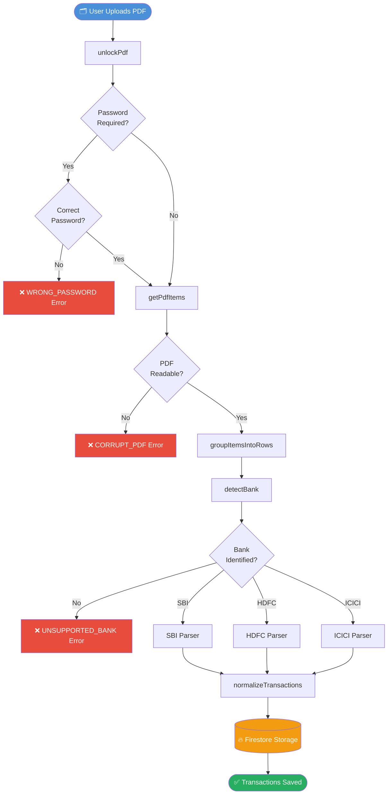
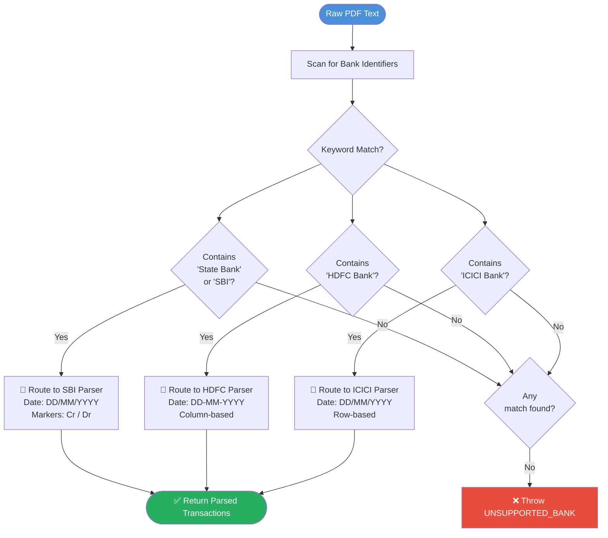
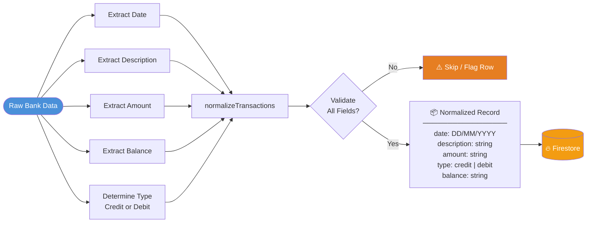
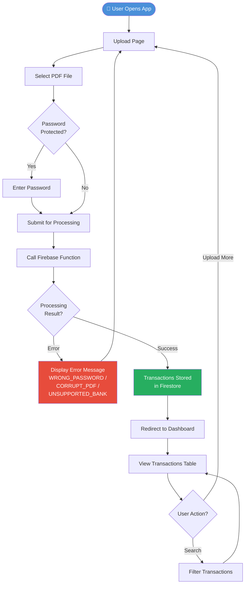
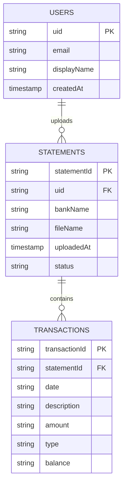

# 🏦 Bank Statement Digitizer

> Automatically extract, parse, and store bank transaction data from PDF statements — with multi-bank support and intelligent detection.

[](.)
[](https://firebase.google.com)
[](https://react.dev)
[](https://vitejs.dev)

---

## 📋 Table of Contents

- [Overview](#overview)
- [Features](#features)
- [Supported Banks](#supported-banks)
- [Tech Stack](#tech-stack)
- [Project Structure](#project-structure)
- [Architecture & Flowcharts](#architecture--flowcharts)
- [Transaction Schema](#transaction-schema)
- [Firestore Collections](#firestore-collections)
- [Installation](#installation)
- [Environment Variables](#environment-variables)
- [Testing](#testing)

---

## Overview

**Bank Statement Digitizer** is a React and Firebase-based application that extracts transaction data from bank statement PDFs. It automatically identifies the bank, applies the appropriate bank-specific parser, and stores normalized transaction data in Firebase Firestore — all in a seamless pipeline from upload to dashboard.

---

## Features

### 📄 PDF Processing
- Upload bank statement PDFs via a clean UI
- Password-protected PDF support
- PDF text extraction powered by `PDF.js`
- Robust PDF error handling

### ⚠️ Error Handling
| Error Code | Description |
|---|---|
| `WRONG_PASSWORD` | Incorrect password for a protected PDF |
| `CORRUPT_PDF` | The PDF file is unreadable or malformed |
| `UNSUPPORTED_BANK` | Statement format does not match any known bank |

### 🏛️ Multi-Bank Support
- **SBI** — State Bank of India
- **HDFC** — HDFC Bank
- **ICICI** — ICICI Bank

### ⚙️ Transaction Processing
- Automatic bank detection from statement content
- Bank-specific transaction parsing
- Transaction normalization into a unified schema
- Direct storage to Firebase Firestore

### 📊 Dashboard
- View all parsed transactions in a clean table
- Search and filter transactions
- Real-time Firestore integration

---

## Supported Banks

| Bank | Date Format | Transaction Markers | Parser |
|---|---|---|---|
| **SBI** | `DD/MM/YYYY` | `Cr` / `Dr` | `parsers/sbi.js` |
| **HDFC** | `DD-MM-YYYY` | Column-based structure | `parsers/hdfc.js` |
| **ICICI** | `DD/MM/YYYY` | Standard row parsing | `parsers/icici.js` |

---

## Tech Stack

| Layer | Technology |
|---|---|
| **Frontend** | React, Vite, Tailwind CSS, React Router |
| **Backend** | Firebase Firestore, Firebase Functions |
| **PDF Processing** | `pdfjs-dist` |

---

## Project Structure

```text
bank-statement-digitizer/
│
├── docs/
│   └── samples.md                  # Sample PDF documentation
│
├── samples/
│   ├── sbi-sample.pdf
│   ├── hdfc-sample.pdf
│   ├── icici-sample.pdf
│   └── axis-sample.pdf
│
├── functions/                      # Firebase Cloud Functions
│   ├── index.js
│   ├── pdfService.js               # Core PDF processing logic
│   │
│   └── parsers/
│       ├── index.js                # Parser router
│       ├── sbi.js
│       ├── hdfc.js
│       └── icici.js
│
├── src/                            # React frontend
│   ├── components/
│   ├── firebase/
│   ├── pages/
│   └── services/
│
├── firebase.json
├── firestore.rules
├── package.json
└── README.md
```

---

## Architecture & Flowcharts

### 1. Full PDF Processing Pipeline

This is the end-to-end flow from the moment a user uploads a PDF to the point where transactions are saved in Firestore.



---

### 2. Bank Detection Logic

How the system reads statement content and routes to the correct parser.



---

### 3. Transaction Normalization Flow

Each bank parser returns raw data. The normalizer converts it into a unified schema.



---

### 4. Frontend Application Flow

How a user interacts with the app from upload to viewing results.



---

### 5. Firestore Data Architecture



---

## Transaction Schema

All bank statements are normalized into a unified format before storage:

```js
{
  date: "01/05/2026",          // DD/MM/YYYY — standardized across all banks
  description: "Salary Credit", // Transaction narration / remarks
  amount: "50000",              // Transaction amount as string
  type: "credit",               // "credit" or "debit"
  balance: "60000"              // Closing balance after transaction
}
```

---

## Firestore Collections

| Collection | Purpose |
|---|---|
| `users` | Stores registered user information |
| `statements` | Metadata for each uploaded PDF statement |
| `transactions` | Normalized transaction records parsed from statements |

---

## Installation

**1. Clone the repository:**

```bash
git clone https://github.com/your-username/bank-statement-digitizer.git
cd bank-statement-digitizer
```

**2. Install dependencies:**

```bash
npm install
```

**3. Set up environment variables** (see section below)

**4. Run the development server:**

```bash
npm run dev
```

**5. (Optional) Deploy Firebase Functions:**

```bash
firebase deploy --only functions
```

---

## Environment Variables

Create a `.env` file in the project root with the following keys from your [Firebase Console](https://console.firebase.google.com):

```env
VITE_FIREBASE_API_KEY=
VITE_FIREBASE_AUTH_DOMAIN=
VITE_FIREBASE_PROJECT_ID=
VITE_FIREBASE_STORAGE_BUCKET=
VITE_FIREBASE_MESSAGING_SENDER_ID=
VITE_FIREBASE_APP_ID=
```

> ⚠️ The `.env` file is listed in `.gitignore` and is never committed to version control.

---

## Testing

### ✅ Test Coverage Summary

| Module | Test | Status |
|---|---|---|
| **PDF Module** | PDF Upload | ✅ Passed |
| | Password Handling | ✅ Passed |
| | PDF Parsing | ✅ Passed |
| **Firestore** | Save Transactions | ✅ Passed |
| | Read Transactions | ✅ Passed |
| **Parsers** | SBI Parser | ✅ Passed |
| | HDFC Parser | ✅ Passed |
| | ICICI Parser | ✅ Passed |
| **Validation** | `WRONG_PASSWORD` | ✅ Passed |
| | `CORRUPT_PDF` | ✅ Passed |
| | `UNSUPPORTED_BANK` | ✅ Passed |
| **End-to-End** | Upload → Parse → Normalize → Store | ✅ Passed |

---

## Project Status

> ✅ **Completed** — Built and tested as part of the Bank Statement Digitizer internship assignment.

All planned features have been implemented, tested, and verified end-to-end.
